# Microservices Architecture

## Overview
A scalable microservices architecture with service discovery, API gateway, and distributed systems patterns.

```mermaid
graph TB
    Client["👥 Client Applications"]
    CDN["🌐 CDN & Load Balancer"]
    APIGw["🚪 API Gateway<br/>(Kong/Nginx)"]
    
    subgraph Services["Microservices Layer"]
        UserSvc["👤 User Service<br/>(Node.js)"]
        OrderSvc["📦 Order Service<br/>(Python)"]
        PaymentSvc["💳 Payment Service<br/>(Go)"]
        NotifSvc["📧 Notification Service<br/>(Java)"]
        AnalyticsSvc["📊 Analytics Service<br/>(Python)"]
    end
    
    subgraph Data["Data Layer"]
        UserDB["🗄️ User DB<br/>(PostgreSQL)"]
        OrderDB["🗄️ Order DB<br/>(MongoDB)"]
        Cache["⚡ Cache<br/>(Redis)"]
        DataWH["📈 Data Warehouse<br/>(BigQuery)"]
    end
    
    subgraph Messaging["Event Bus"]
        EventBus["🔄 Message Queue<br/>(RabbitMQ/Kafka)"]
    end
    
    subgraph Monitoring["Observability Stack"]
        Logs["📝 Logs<br/>(ELK Stack)"]
        Metrics["📊 Metrics<br/>(Prometheus)"]
        Traces["🔍 Traces<br/>(Jaeger)"]
        Alerts["🚨 Alerts<br/>(AlertManager)"]
    end
    
    subgraph Infrastructure["Infrastructure"]
        K8s["☸️ Kubernetes<br/>(Orchestration)"]
        Registry["🐳 Container Registry<br/>(Docker)"]
    end
    
    Client -->|HTTPS| CDN
    CDN -->|Routes| APIGw
    APIGw -->|Route| UserSvc
    APIGw -->|Route| OrderSvc
    APIGw -->|Route| PaymentSvc
    
    UserSvc -->|Read/Write| UserDB
    UserSvc -->|Cache| Cache
    OrderSvc -->|Read/Write| OrderDB
    PaymentSvc -->|Emit Events| EventBus
    NotifSvc -->|Subscribe| EventBus
    AnalyticsSvc -->|Subscribe| EventBus
    AnalyticsSvc -->|Store| DataWH
    
    UserSvc -->|Metrics| Metrics
    OrderSvc -->|Metrics| Metrics
    PaymentSvc -->|Metrics| Metrics
    UserSvc -->|Logs| Logs
    OrderSvc -->|Logs| Logs
    Metrics -->|Alert| Alerts
    Traces -->|Monitor| Alerts
    
    K8s -->|Deploy| UserSvc
    K8s -->|Deploy| OrderSvc
    K8s -->|Deploy| PaymentSvc
    K8s -->|Deploy| NotifSvc
    K8s -->|Deploy| AnalyticsSvc
    Registry -->|Images| K8s
    
    style Client fill:#ff6b6b
    style APIGw fill:#4ecdc4
    style Services fill:#45b7d1
    style Data fill:#ffd93d
    style Messaging fill:#f38181
    style Monitoring fill:#aa96da
    style Infrastructure fill:#fcbad3
```

## Key Components

- **API Gateway**: Single entry point for all client requests
- **Microservices**: Independent, scalable services with different tech stacks
- **Message Queue**: Asynchronous communication between services
- **Data Layer**: Polyglot persistence (different databases for different needs)
- **Kubernetes**: Container orchestration and management
- **Observability**: Comprehensive logging, metrics, and tracing

## Benefits

- **Scalability**: Scale individual services independently
- **Resilience**: Failure in one service doesn't affect others
- **Flexibility**: Use different technologies for different services
- **Fast Deployment**: Deploy services without affecting others