# AWS Cloud Architecture

## Highly Available & Scalable Cloud Infrastructure

```mermaid
graph TB
    Users["👥 End Users"]
    Route53["🌍 Route 53<br/>(DNS)"]
    CloudFront["🚀 CloudFront<br/>(CDN)"]
    
    subgraph Region["AWS Region"]
        subgraph AZ1["Availability Zone 1"]
            ALB1["⚖️ ALB"]
            EC2_1["💻 EC2 Instance"]
            Lambda1["⚡ Lambda"]
        end
        
        subgraph AZ2["Availability Zone 2"]
            ALB2["⚖️ ALB"]
            EC2_2["💻 EC2 Instance"]
            Lambda2["⚡ Lambda"]
        end
        
        ELB["🎯 Elastic Load Balancer"]
        
        subgraph Storage["Storage Layer"]
            S3["📦 S3 Bucket<br/>(Static Assets)"]
            EBS["💾 EBS Volumes<br/>(Persistent Storage)"]
            EFS["📂 EFS<br/>(Shared Storage)"]
        end
        
        subgraph Database["Database Layer"]
            RDS["🗄️ RDS Aurora<br/>(Primary)"]
            DynamoDB["⚡ DynamoDB<br/>(NoSQL)"]
            Elasticache["🔥 ElastiCache<br/>(Redis)"]
        end
        
        subgraph Compute["Serverless & Containers"]
            ECS["🐳 ECS Fargate"]
            StepFunctions["📋 Step Functions"]
        end
    end
    
    subgraph Edge["Edge & Acceleration"]
        WAF["🛡️ WAF<br/>(Web Application Firewall)"]
        Shield["🔒 Shield<br/>(DDoS Protection)"]
    end
    
    subgraph Management["Management & Monitoring"]
        CloudWatch["📊 CloudWatch<br/>(Monitoring)"]
        Logs["📝 CloudWatch Logs"]
        X_Ray["🔍 X-Ray<br/>(Tracing)"]
        SNS["📢 SNS<br/>(Notifications)"]
    end
    
    subgraph Security["Security"]
        IAM["🔐 IAM<br/>(Access Control)"]
        KMS["🔑 KMS<br/>(Key Management)"]
        Secrets["🤫 Secrets Manager"]
    end
    
    subgraph BackupDR["Backup & Disaster Recovery"]
        Backup["💾 AWS Backup"]
        Replication["🔄 Cross-Region<br/>Replication"]
    end
    
    Users -->|DNS Query| Route53
    Route53 -->|Route| CloudFront
    CloudFront -->|Serve| S3
    CloudFront -->|Route to| WAF
    WAF -->|Filter| Shield
    Shield -->|Forward| ELB
    
    ELB -->|Distribute| ALB1
    ELB -->|Distribute| ALB2
    
    ALB1 -->|Route| EC2_1
    ALB1 -->|Trigger| Lambda1
    ALB2 -->|Route| EC2_2
    ALB2 -->|Trigger| Lambda2
    
    EC2_1 -->|Read/Write| RDS
    EC2_2 -->|Read/Write| RDS
    Lambda1 -->|Query| DynamoDB
    Lambda2 -->|Query| DynamoDB
    EC2_1 -->|Cache| Elasticache
    EC2_2 -->|Cache| Elasticache
    
    ECS -->|Orchestrate| EC2_1
    ECS -->|Orchestrate| EC2_2
    StepFunctions -->|Orchestrate| Lambda1
    
    EC2_1 -->|Mount| EFS
    EC2_2 -->|Mount| EFS
    EC2_1 -->|Store| EBS
    EC2_2 -->|Store| EBS
    
    CloudWatch -->|Monitor| EC2_1
    CloudWatch -->|Monitor| EC2_2
    CloudWatch -->|Monitor| Lambda1
    Logs -->|Aggregate| CloudWatch
    X_Ray -->|Trace| Lambda1
    CloudWatch -->|Alert| SNS
    
    IAM -->|Authorize| EC2_1
    IAM -->|Authorize| Lambda1
    KMS -->|Encrypt| EBS
    Secrets -->|Store| EC2_1
    
    RDS -->|Backup to| Backup
    S3 -->|Replicate to| Replication
    
    style Region fill:#ff9900
    style AZ1 fill:#146eb4
    style AZ2 fill:#146eb4
    style Storage fill:#569a31
    style Database fill:#1f5e74
    style Management fill:#ff7900
    style Security fill:#dd344c
``` 

## Key Components

- **Route 53**: DNS management and routing
- **CloudFront**: Global content delivery network
- **WAF & Shield**: Security and DDoS protection
- **Multi-AZ**: High availability across availability zones
- **RDS Aurora**: Managed relational database
- **DynamoDB**: Fully managed NoSQL database
- **Lambda**: Serverless computing
- **CloudWatch**: Comprehensive monitoring and logging

## Architecture Benefits

- **High Availability**: Multi-AZ deployment ensures uptime
- **Auto Scaling**: Automatically scale resources based on demand
- **Managed Services**: AWS handles infrastructure management
- **Global Reach**: CloudFront delivers content worldwide
- **Security First**: Multiple layers of security controls