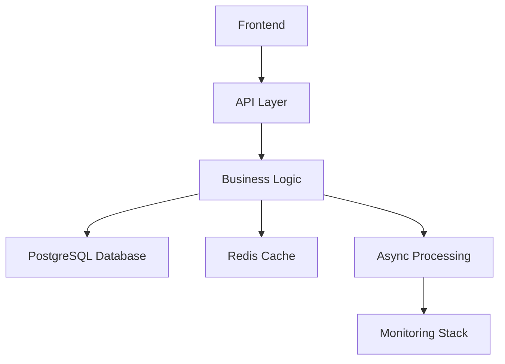

```mermaid
    graph TD;
        A[Frontend] --> B[API Layer];
        B --> C[Business Logic];
        C --> D[PostgreSQL Database];
        C --> E[Redis Cache];
        C --> F[Async Processing];
        F --> G[Monitoring Stack];
```
