# Modern Web Application Architecture

## Full-Stack Web Application with Clean Architecture

```mermaid
graph TB
    subgraph Client["Client Layer - Frontend"]
        Browser["🌐 Web Browser"]
        SPA["⚛️ SPA Framework<br/>(React/Vue/Angular)"]
        PWA["📱 PWA Features<br/>(Service Workers)"]
        LocalStorage["💾 Local Storage<br/>(IndexedDB)"]
    end
    
    subgraph Network["Network Layer"]
        CDN["🚀 CDN<br/>(Static Assets)"]
        LoadBalancer["⚖️ Load Balancer<br/>(Nginx/HAProxy)"]
        HTTPS["🔒 HTTPS/TLS"]
    end
    
    subgraph Backend["Backend Layer"]
        subgraph APILayer["API Layer"]
            APIGateway["🚪 API Gateway<br/>(Rate Limiting)"]
            AuthService["🔐 Auth Service<br/>(JWT/OAuth2)"]
            APIServer["🖥️ API Server<br/>(Node.js/Python/Go)"]
        end
        
        subgraph BizLogic["Business Logic Layer"]
            UserHandler["👤 User Handler"]
            OrderHandler["📦 Order Handler"]
            PaymentHandler["💳 Payment Handler"]
        end
        
        subgraph DataLayer["Data Access Layer"]
            ORM["🔌 ORM<br/>(Sequelize/SQLAlchemy)"]
            Repo["📚 Repository Pattern"]
        end
    end
    
    subgraph Persistence["Persistence Layer"]
        MainDB["🗄️ Primary Database<br/>(PostgreSQL)"]
        CacheDB["⚡ Cache<br/>(Redis)"]
        SearchEngine["🔍 Search Engine<br/>(Elasticsearch)"]
        FileStorage["📁 File Storage<br/>(S3/MinIO)"]
    end
    
    subgraph AsyncProcessing["Async Processing"]
        Queue["📮 Job Queue<br/>(Bull/Celery)"]
        Workers["⚙️ Background Workers"]
        Scheduler["⏰ Scheduled Tasks<br/>(Cron)"]
    end
    
    subgraph Integration["External Integrations"]
        Payment["💳 Payment Gateway<br/>(Stripe/PayPal)"]
        Email["📧 Email Service<br/>(SendGrid)"]
        SMS["📞 SMS Service<br/>(Twilio)"]
        Analytics["📊 Analytics<br/>(Mixpanel)"]
    end
    
    subgraph Monitoring["Observability & DevOps"]
        Logs["📝 Centralized Logging<br/>(ELK)"]
        Metrics["📊 Metrics<br/>(Prometheus/Grafana)"]
        APM["🔍 APM<br/>(New Relic/DataDog)"]
        ErrorTracking["🐛 Error Tracking<br/>(Sentry)"]
    end
    
    subgraph Testing["Testing & Quality"]
        UnitTests["✅ Unit Tests<br/>(Jest)"]
        Integration["🧪 Integration Tests"]
        E2E["🎬 E2E Tests<br/>(Cypress)"]
    end
    
    subgraph CI_CD["CI/CD Pipeline"]
        Git["📖 Git Repository"]
        Pipeline["⚡ CI/CD<br/>(GitHub Actions)"]
        Registry["🐳 Docker Registry"]
        Deploy["🚀 Deployment<br/>(AWS/Heroku)"]
    end
    
    Browser -->|User Interaction| SPA
    SPA -->|Cache| LocalStorage
    SPA -->|Offline Support| PWA
    SPA -->|HTTPS| HTTPS
    HTTPS -->|Request| LoadBalancer
    LoadBalancer -->|Route| APIGateway
    LoadBalancer -->|Serve| CDN
    
    APIGateway -->|Authenticate| AuthService
    APIGateway -->|Forward| APIServer
    
    APIServer -->|Route| UserHandler
    APIServer -->|Route| OrderHandler
    APIServer -->|Route| PaymentHandler
    
    UserHandler -->|Access Data| ORM
    OrderHandler -->|Access Data| ORM
    PaymentHandler -->|Access Data| ORM
    ORM -->|Use Pattern| Repo
    
    Repo -->|Query| MainDB
    Repo -->|Cache| CacheDB
    UserHandler -->|Search| SearchEngine
    OrderHandler -->|Store Files| FileStorage
    
    OrderHandler -->|Enqueue| Queue
    PaymentHandler -->|Enqueue| Queue
    Queue -->|Process| Workers
    Scheduler -->|Trigger| Workers
    
    PaymentHandler -->|Call| Payment
    Workers -->|Send| Email
    Workers -->|Send| SMS
    SPA -->|Track| Analytics
    
    APIServer -->|Log| Logs
    APIServer -->|Metric| Metrics
    APIServer -->|Monitor| APM
    APIServer -->|Track Error| ErrorTracking
    
    APIServer -->|Test| UnitTests
    APIServer -->|Test| Integration
    SPA -->|Test| E2E
    
    Git -->|Trigger| Pipeline
    Pipeline -->|Build| Registry
    Pipeline -->|Test| Integration
    Pipeline -->|Deploy| Deploy
    Deploy -->|Run| APIServer
    
    style Client fill:#61dafb
    style Backend fill:#68a063
    style Persistence fill:#336791
    style AsyncProcessing fill:#f8b500
    style Monitoring fill:#f1502f
    style CI_CD fill:#ff6c37
```

## Architecture Layers

- **Client Layer**: React/Vue/Angular SPA with PWA support
- **Network Layer**: CDN and HTTPS/TLS security
- **Backend Layer**: API Gateway, Auth, and Business Logic
- **Persistence Layer**: Multiple databases for different needs
- **Async Processing**: Background jobs and scheduling
- **External Integrations**: Payment, Email, SMS, Analytics
- **Observability**: Comprehensive monitoring and error tracking
- **CI/CD**: Automated testing and deployment

## Architecture Patterns Used

- **Layered Architecture**: Separation of concerns
- **Repository Pattern**: Data access abstraction
- **Service Layer**: Business logic encapsulation
- **Event-Driven**: Async processing with queues
- **CQRS Ready**: Scalable read/write operations