# CI/CD Pipeline Architecture

## Automated Deployment Pipeline with Testing & Quality Gates

```mermaid
graph LR
    Dev["👨‍💻 Developer<br/>Push Code"]
    
    Git["📖 Git Repository<br/>(GitHub)"]
    
    subgraph CI["Continuous Integration"]
        Trigger["🔔 Webhook Trigger"]
        Build["🔨 Build<br/>(Compile/Bundle)"]
        UnitTest["✅ Unit Tests<br/>(Jest/Pytest)"]
        SAST["🔍 SAST<br/>(Code Analysis)"]
        CoverageCheck["📊 Coverage Check<br/(>80%)"]
    end
    
    subgraph SecurityScan["Security Scanning"]
        Secrets["🔑 Secrets Detection<br/>(TruffleHog)"]
        Dependencies["📦 Dependency Check<br/>(Snyk)"]
        Container["🐳 Container Scan<br/>(Trivy)"]
        DAST["🎯 DAST<br/>(ZAP)"]
    end
    
    subgraph Testing["Testing Layer"]
        Integration["🧪 Integration Tests"]
        E2E["🎬 E2E Tests<br/>(Selenium)"]
        Performance["⚡ Performance Tests<br/>(JMeter)"]
    end
    
    subgraph Approval["Quality Gates & Approval"]
        QA["👨‍🔬 QA Review"]
        Manual["👤 Manual Approval"]
        DecideStaging["📋 Route to Staging"]
        DecidetoProd["📋 Route to Production"]
    end
    
    subgraph Staging["Staging Environment"]
        StagingDeploy["🚀 Deploy to Staging"]
        StagingDB["🗄️ Staging DB<br/>(Replica)"]
        StagingMonitor["📊 Monitor Metrics"]
        SmokeTest["🔥 Smoke Tests"]
    end
    
    subgraph Production["Production Environment"]
        BlueGreen["🔵🟢 Blue-Green<br/>Deployment"]
        Canary["🐦 Canary Release<br/>(5% Traffic)"]
        ProdDB["🗄️ Prod DB<br/>(Replicated)"]
        CDN["🚀 CDN<br/>(Edge Cache)"]
        LB["⚖️ Load Balancer"]
    end
    
    subgraph Monitoring["Post-Deployment Monitoring"]
        Metrics["📊 Metrics<br/>(Prometheus)"]
        Logs["📝 Logs<br/>(ELK)"]
        APM["🔍 APM<br/>(DataDog)"]
        ErrorRate["📈 Error Rate<br/>Monitoring"]
        Alerting["🚨 Alerts<br/>(PagerDuty)"]
    end
    
    subgraph Rollback["Rollback Strategy"]
        HealthCheck["❤️ Health Check"]
        AutoRollback["⏮️ Auto Rollback<br/>(If Failed)"]
    end
    
    Dev -->|Commit & Push| Git
    Git -->|Trigger| Trigger
    
    Trigger -->|Start| Build
    Build -->|Pass| UnitTest
    UnitTest -->|Pass| SAST
    SAST -->|Pass| CoverageCheck
    
    Build -->|Scan| Secrets
    Build -->|Scan| Dependencies
    Secrets -->|Pass| Container
    Dependencies -->|Pass| Container
    
    CoverageCheck -->|Pass| Integration
    Container -->|Pass| E2E
    Integration -->|Pass| Performance
    Performance -->|Pass| QA
    E2E -->|Pass| QA
    
    QA -->|Approve| Manual
    Manual -->|Staging| DecideStaging
    Manual -->|Production| DecidetoProd
    
    DecideStaging -->|Deploy| StagingDeploy
    StagingDeploy -->|Use| StagingDB
    StagingDeploy -->|Monitor| StagingMonitor
    StagingMonitor -->|Run| SmokeTest
    SmokeTest -->|Pass| Manual
    
    DecidetoProd -->|Start| BlueGreen
    BlueGreen -->|Route 5%| Canary
    Canary -->|Use| ProdDB
    Canary -->|Cache| CDN
    Canary -->|Route| LB
    
    LB -->|Collect| Metrics
    LB -->|Collect| Logs
    LB -->|Monitor| APM
    Metrics -->|Check| ErrorRate
    ErrorRate -->|Alert| Alerting
    
    ErrorRate -->|Monitor| HealthCheck
    HealthCheck -->|Failed| AutoRollback
    AutoRollback -->|Revert| BlueGreen
    
    Alerting -->|Critical| Rollback
    
    style CI fill:#4ecdc4
    style SecurityScan fill:#f38181
    style Testing fill:#95e1d3
    style Approval fill:#ffd93d
    style Staging fill:#a8edea
    style Production fill:#fed330
    style Monitoring fill:#ff9999
```

## Pipeline Stages

1. **Continuous Integration**: Code compilation, unit testing, and static analysis
2. **Security Scanning**: Vulnerability detection, secrets scanning, and container scanning
3. **Testing**: Comprehensive test coverage (integration, E2E, performance)
4. **Quality Gates**: Automated checks and code coverage requirements
5. **Staging**: Pre-production validation with replica database
6. **Production**: Safe deployment with blue-green and canary strategies
7. **Monitoring**: Real-time metrics, logs, and alerting
8. **Rollback**: Automated recovery on failures

## Key Features

- **Automated Testing**: Unit, integration, E2E, and performance tests
- **Security First**: Secrets detection, dependency checking, container scanning
- **Quality Gates**: Code coverage and static analysis requirements
- **Safe Deployments**: Blue-green and canary release strategies
- **Auto Rollback**: Automatic rollback on health check failures