# Event-Driven Architecture

## Asynchronous Event-Based System with Event Sourcing

```mermaid
graph TB
    subgraph Producers["Event Producers"]
        WebUI["🌐 Web UI<br/>(User Actions)"]
        MobileApp["📱 Mobile App"]
        ExternalAPI["🔌 External APIs"]
        IoTDevices["📡 IoT Devices"]
        Scheduler["⏰ Scheduled Tasks"]
    end
    
    subgraph EventBus["Event Bus Layer"]
        Kafka["📮 Apache Kafka<br/>(Event Broker)"]
        Topics["🏷️ Event Topics"]
    end
    
    subgraph EventProcessing["Event Processing"]
        EventProcessor["⚙️ Event Processor<br/>(Kafka Streams)"]
        ComplexEventProcessing["🧩 CEP<br/>(Drools)"]
        SagaOrchestrator["🎭 Saga Orchestrator<br/>(Temporal)"]
    end
    
    subgraph Services["Microservices - Event Handlers"]
        OrderService["📦 Order Service"]
        PaymentService["💳 Payment Service"]
        InventoryService["📊 Inventory Service"]
        NotificationService["📧 Notification Service"]
        AnalyticsService["📈 Analytics Service"]
    end
    
    subgraph EventStore["Event Store & State"]
        EventLog["📔 Event Log<br/>(Immutable)"]
        Snapshots["📸 Snapshots<br/>(Point-in-time)"]
        StateStore["🗄️ State Store<br/>(Current State)"]
    end
    
    subgraph ReadModels["Read Models"]
        ReadDB1["📘 Read DB 1<br/>(Orders)"]
        ReadDB2["📗 Read DB 2<br/>(Payments)"]
        ReadDB3["📙 Read DB 3<br/>(Analytics)"]
        Cache["⚡ Cache<br/>(Redis)"]
    end
    
    subgraph Queries["Query Layer"]
        QueryAPI["🔍 Query API<br/>(GraphQL/REST)"]
        ViewService["👁️ View Service"]
    end
    
    subgraph Integration["External Integrations"]
        PaymentGateway["💳 Payment Gateway"]
        EmailService["📧 Email Service"]
        SMSService["📞 SMS Service"]
        WebhookConnector["🪝 Webhook Connector"]
    end
    
    subgraph Monitoring["Observability"]
        EventMetrics["📊 Event Metrics<br/>(Prometheus)"]
        DistributedTracing["🔍 Distributed Tracing<br/>(Jaeger)"]
        EventAuditing["📝 Event Auditing<br/>(Compliance)"]
        DeadLetterQueue["💀 Dead Letter Queue<br/>(Failed Events)"]
    end
    
    subgraph Resilience["Resilience Patterns"]
        Retry["🔄 Retry Logic<br/>(Exponential Backoff)"]
        CircuitBreaker["⚡ Circuit Breaker<br/>(Pattern)"]
        Timeout["⏱️ Timeout Handler"]
        Fallback["🔀 Fallback Handler"]
    end
    
    WebUI -->|Emit Events| Kafka
    MobileApp -->|Emit Events| Kafka
    ExternalAPI -->|Emit Events| Kafka
    IoTDevices -->|Emit Events| Kafka
    Scheduler -->|Emit Events| Kafka
    
    Kafka -->|Organize| Topics
    Topics -->|Consume| EventProcessor
    Topics -->|Process| ComplexEventProcessing
    Topics -->|Orchestrate| SagaOrchestrator
    
    EventProcessor -->|Route| OrderService
    ComplexEventProcessing -->|Route| PaymentService
    SagaOrchestrator -->|Coordinate| InventoryService
    Topics -->|Subscribe| NotificationService
    Topics -->|Subscribe| AnalyticsService
    
    OrderService -->|Store| EventLog
    PaymentService -->|Store| EventLog
    InventoryService -->|Store| EventLog
    EventLog -->|Create| Snapshots
    EventLog -->|Update| StateStore
    
    StateStore -->|Build| ReadDB1
    StateStore -->|Build| ReadDB2
    StateStore -->|Build| ReadDB3
    ReadDB1 -->|Cache| Cache
    ReadDB2 -->|Cache| Cache
    ReadDB3 -->|Cache| Cache
    
    QueryAPI -->|Query| ReadDB1
    QueryAPI -->|Query| ReadDB2
    ViewService -->|Query| Cache
    
    PaymentService -->|Call| PaymentGateway
    NotificationService -->|Call| EmailService
    NotificationService -->|Call| SMSService
    OrderService -->|Webhook| WebhookConnector
    
    OrderService -->|Emit| EventMetrics
    PaymentService -->|Emit| EventMetrics
    OrderService -->|Trace| DistributedTracing
    PaymentService -->|Log| EventAuditing
    EventProcessor -->|DLQ| DeadLetterQueue
    
    OrderService -->|Use| Retry
    PaymentService -->|Use| CircuitBreaker
    NotificationService -->|Use| Timeout
    InventoryService -->|Use| Fallback
    
    style Producers fill:#ff6b6b
    style EventBus fill:#4ecdc4
    style EventProcessing fill:#95e1d3
    style Services fill:#45b7d1
    style EventStore fill:#ffd93d
    style ReadModels fill:#a8edea
    style Queries fill:#fcbad3
    style Integration fill:#f38181
    style Monitoring fill:#aa96da
    style Resilience fill:#ff9999
```

## Event-Driven Patterns

- **Event Sourcing**: Store all changes as immutable events
- **CQRS**: Separate read and write models
- **Saga Pattern**: Distributed transaction management
- **Event Processing**: Real-time event stream processing
- **Asynchronous Messaging**: Decoupled service communication

## Key Components

- **Event Producers**: Sources that emit domain events
- **Event Bus**: Central event broker (Kafka, RabbitMQ)
- **Event Processors**: Transform and route events
- **Event Store**: Immutable log of all events
- **Read Models**: Optimized views for queries
- **Resilience**: Retry, circuit breaker, timeout patterns
- **Observability**: Comprehensive event tracking and monitoring

## Benefits

- **Scalability**: Services scale independently
- **Resilience**: Graceful handling of failures
- **Auditability**: Complete audit trail of all events
- **Temporal Decoupling**: Services don't need to be up at the same time
- **Event Replay**: Reconstruct state from event log