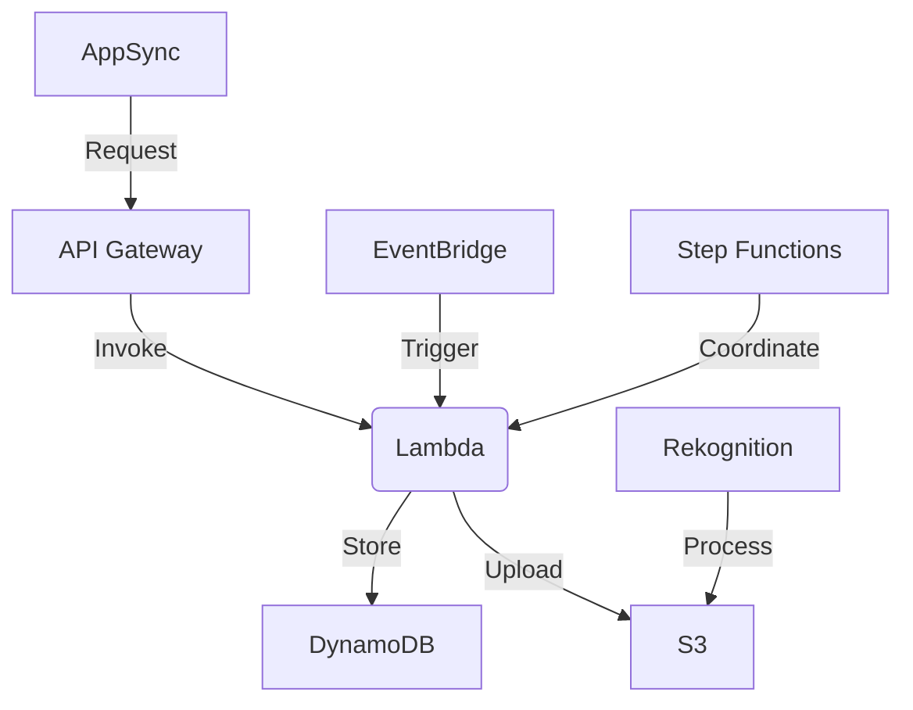

```mermaid
  graph TD;
    A[API Gateway] -->|Invoke| B(Lambda);
    B -->|Store| C[DynamoDB];
    B -->|Upload| D[S3];
    E[EventBridge] -->|Trigger| B;
    F[Step Functions] -->|Coordinate| B;
    G[Rekognition] -->|Process| D;
    H[AppSync] -->|Request| A;
```