# Serverless Architecture

## Fully Managed Serverless Computing Platform

```mermaid
graph TB
    subgraph Clients["Client Applications"]
        Web["🌐 Web Browser"]
        Mobile["📱 Mobile App"]
        ThirdParty["🔌 Third-Party Apps"]
    end
    
    subgraph APIManagement["API Management"]
        APIGateway["🚪 API Gateway<br/>(AWS API Gateway)"]
        AuthLayer["🔐 Cognito/Auth0<br/>(Authentication)"]
        RateLimiting["⚖️ Rate Limiting<br/>(Throttling)"]
    end
    
    subgraph Compute["Serverless Compute"]
        Lambda1["⚡ Lambda Function<br/>(User Service)"]
        Lambda2["⚡ Lambda Function<br/>(Order Service)"]
        Lambda3["⚡ Lambda Function<br/>(Payment Service)"]
        Lambda4["⚡ Lambda Function<br/>(Notification)"]
        Lambda5["⚡ Lambda Function<br/>(Analytics)"]
    end
    
    subgraph AsyncCompute["Asynchronous Computing"]
        EventBridge["🌉 EventBridge<br/>(Event Router)"]
        SQS["📮 SQS<br/>(Message Queue)"]
        SNS["📢 SNS<br/>(Pub/Sub)"]
        StepFunctions["📋 Step Functions<br/>(Orchestration)"]
    end
    
    subgraph Storage["Storage Services"]
        S3["📦 S3<br/>(Object Storage)"]
        DynamoDB["⚡ DynamoDB<br/>(NoSQL)"]
        RDS["🗄️ Aurora Serverless<br/>(Relational)"]
        ElastiCache["🔥 ElastiCache<br/>(In-Memory)"]
    end
    
    subgraph DataProcessing["Data Processing"]
        Glue["🧹 AWS Glue<br/>(ETL)"]
        Athena["🔍 Athena<br/>(Query)"]
        Kinesis["🌊 Kinesis<br/>(Streaming)"]
        Lambda_Data["⚡ Lambda<br/>(Processing)"]
    end
    
    subgraph ML["Machine Learning"]
        Sagemaker["🤖 SageMaker<br/>(ML Platform)"]
        Rekognition["👁️ Rekognition<br/>(Image/Video)"]
        Textract["📄 Textract<br/>(Document)"]
        Comprehend["💬 Comprehend<br/>(NLP)"]
    end
    
    subgraph Integration["Integrations & Connectors"]
        SNSEmail["📧 SNS Email"]
        Cognito["🔐 Cognito<br/>(User Management)"]
        Secrets["🤫 Secrets Manager"]
        SESEmail["📨 SES<br/>(Email)"]
    end
    
    subgraph Monitoring["Observability & Logging"]
        CloudWatch["📊 CloudWatch<br/>(Metrics/Logs)"]
        XRay["🔍 X-Ray<br/>(Tracing)"]
        CloudTrail["📝 CloudTrail<br/>(Audit)"]
    end
    
    subgraph Security["Security & Compliance"]
        IAM["🔐 IAM<br/>(Access Control)"]
        KMS["🔑 KMS<br/>(Encryption)"]
        VPC["🛡️ VPC<br/>(Network)"]
    end
    
    subgraph CDN["Content Delivery"]
        CloudFront["🚀 CloudFront<br/>(CDN)"]
        S3Static["📦 S3<br/>(Static Assets)"]
    end
    
    Web -->|Request| APIGateway
    Mobile -->|Request| APIGateway
    ThirdParty -->|Request| APIGateway
    
    APIGateway -->|Auth| AuthLayer
    AuthLayer -->|Rate Limit| RateLimiting
    RateLimiting -->|Route| Lambda1
    RateLimiting -->|Route| Lambda2
    RateLimiting -->|Route| Lambda3
    
    Lambda1 -->|Read/Write| DynamoDB
    Lambda2 -->|Read/Write| RDS
    Lambda3 -->|Call| StepFunctions
    StepFunctions -->|Coordinate| Lambda4
    Lambda1 -->|Cache| ElastiCache
    
    Lambda3 -->|Emit Event| EventBridge
    EventBridge -->|Route| SQS
    EventBridge -->|Route| SNS
    SQS -->|Trigger| Lambda4
    SNS -->|Trigger| Lambda5
    Lambda4 -->|Send| SNSEmail
    Lambda5 -->|Store| S3
    
    Lambda2 -->|Store Files| S3
    Lambda1 -->|Query| Athena
    S3 -->|Transform| Glue
    Glue -->|Process| Lambda_Data
    Kinesis -->|Stream| Lambda_Data
    
    Lambda4 -->|ML| Sagemaker
    S3 -->|Image Analysis| Rekognition
    S3 -->|Document Analysis| Textract
    Lambda5 -->|NLP| Comprehend
    
    Lambda1 -->|Get Secret| Secrets
    Lambda2 -->|Email| SESEmail
    
    Lambda1 -->|Log/Metric| CloudWatch
    Lambda2 -->|Trace| XRay
    APIGateway -->|Audit| CloudTrail
    
    Lambda1 -->|IAM Policy| IAM
    Lambda2 -->|Encryption| KMS
    APIGateway -->|Network| VPC
    
    S3Static -->|Serve via| CloudFront
    CloudFront -->|Cache| CloudFront
    
    style Clients fill:#ff6b6b
    style APIManagement fill:#4ecdc4
    style Compute fill:#45b7d1
    style AsyncCompute fill:#95e1d3
    style Storage fill:#ffd93d
    style DataProcessing fill:#a8edea
    style ML fill:#f38181
    style Integration fill:#fcbad3
    style Monitoring fill:#aa96da
    style Security fill:#ff9999
    style CDN fill:#c7b3e5
```

## Serverless Components

- **Lambda**: Event-driven compute functions
- **API Gateway**: HTTP endpoint management
- **DynamoDB**: Fully managed NoSQL database
- **S3**: Object storage
- **SQS/SNS**: Asynchronous messaging
- **Step Functions**: Workflow orchestration
- **EventBridge**: Event routing and transformation

## Key Benefits

- **No Server Management**: AWS manages infrastructure
- **Auto Scaling**: Automatic scale based on demand
- **Pay-Per-Use**: Only pay for execution time
- **High Availability**: Built-in redundancy
- **Fast Deployment**: Deploy code instantly

## Use Cases

- **REST APIs**: API Gateway + Lambda
- **Event Processing**: EventBridge + Lambda
- **Data Pipelines**: Glue + Lambda + Athena
- **Real-time Analytics**: Kinesis + Lambda
- **ML Inference**: SageMaker + Lambda