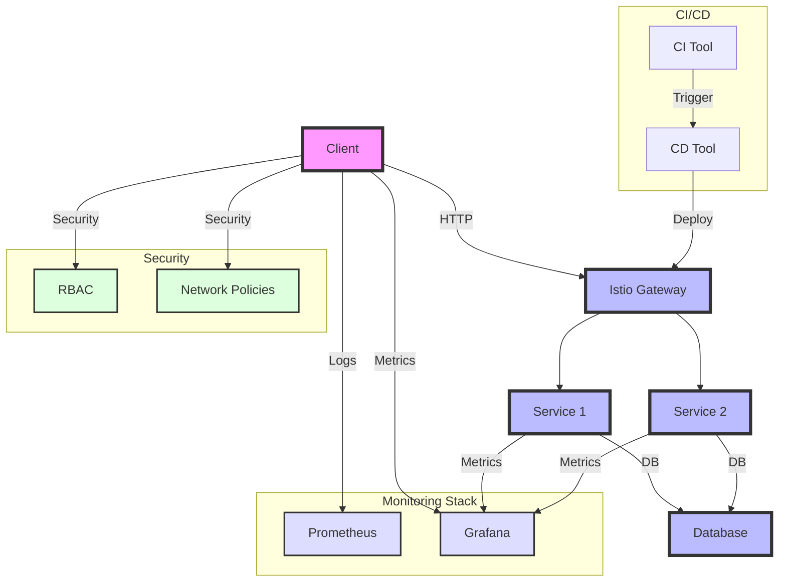

```mermaid
graph TD;
    A[Client] -->|HTTP| B[Istio Gateway];
    B --> C[Service 1];
    B --> D[Service 2];
    C -->|DB| E[Database];
    D -->|DB| E;

    style A fill:#f9f,stroke:#333,stroke-width:4px;
    style B fill:#bbf,stroke:#333,stroke-width:4px;
    style C fill:#bbf,stroke:#333,stroke-width:4px;
    style D fill:#bbf,stroke:#333,stroke-width:4px;
    style E fill:#bbf,stroke:#333,stroke-width:4px;

    subgraph Monitoring Stack;
        M1[Prometheus];
        M2[Grafana];
    end;

    subgraph Security;
        S1[RBAC];
        S2[Network Policies];
    end;

    A -->|Logs| M1;
    A -->|Metrics| M2;
    C -->|Metrics| M2;
    D -->|Metrics| M2;
    A -->|Security| S1;
    A -->|Security| S2;

    style M1 fill:#ddf,stroke:#333,stroke-width:2px;
    style M2 fill:#ddf,stroke:#333,stroke-width:2px;
    style S1 fill:#dfd,stroke:#333,stroke-width:2px;
    style S2 fill:#dfd,stroke:#333,stroke-width:2px;

    subgraph CI/CD;
        C1[CI Tool];
        C2[CD Tool];
    end;

    C1 -->|Trigger| C2;
    C2 -->|Deploy| B;
```