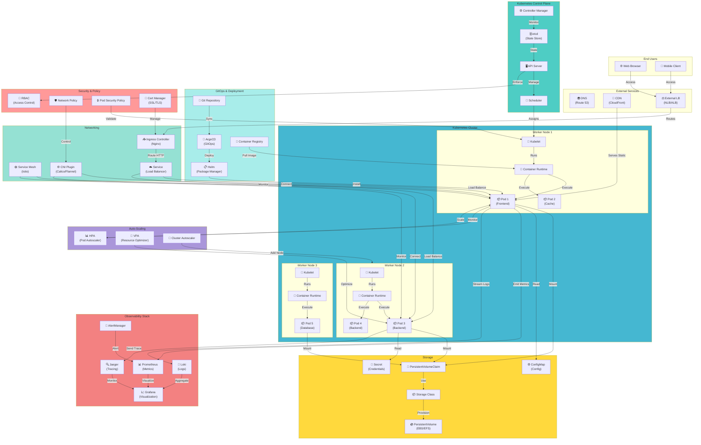

# Kubernetes Cluster Architecture

## Production-Grade Kubernetes Infrastructure

## Kubernetes Architecture Components

### Control Plane
- **API Server**: RESTful interface for cluster management
- **Scheduler**: Assigns pods to nodes
- **Controller Manager**: Runs controller processes
- **etcd**: Distributed key-value store for cluster state

### Worker Nodes
- **Kubelet**: Agent that runs on each node
- **Container Runtime**: Executes containers (Docker, containerd)
- **kube-proxy**: Network proxy for services

### Networking
- **Ingress**: HTTP/HTTPS routing
- **Service Mesh**: Advanced traffic management (Istio)
- **CNI Plugin**: Container network interface

### Storage
- **PersistentVolume**: Cluster-wide storage resource
- **PersistentVolumeClaim**: Storage request by pods
- **StorageClass**: Storage provisioning templates

### Key Features

- **Self-Healing**: Automatic pod restart and replacement
- **Load Balancing**: Service discovery and load balancing
- **Auto-Scaling**: HPA and cluster autoscaling
- **Rolling Updates**: Zero-downtime deployments
- **Resource Management**: CPU/memory requests and limits
- **Security**: RBAC, network policies, pod security

### GitOps with ArgoCD

- **Declarative Configuration**: Infrastructure as code
- **Automated Sync**: Automatic deployment on Git changes
- **Version Control**: Full audit trail of changes
